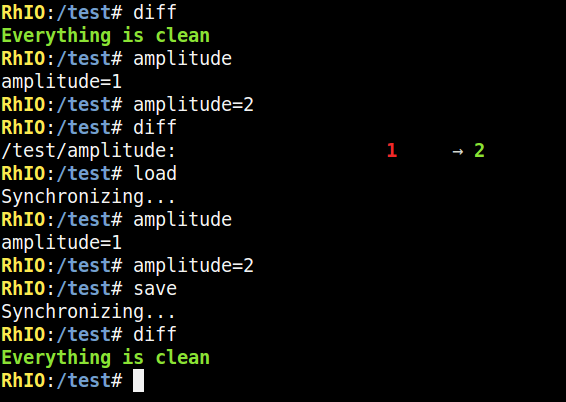
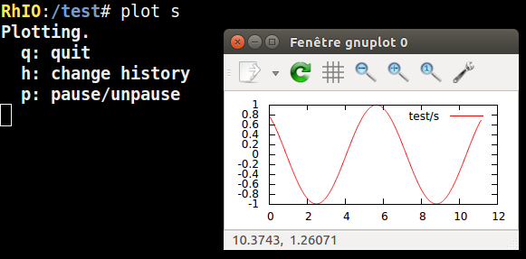
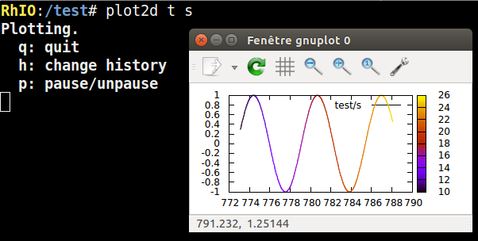
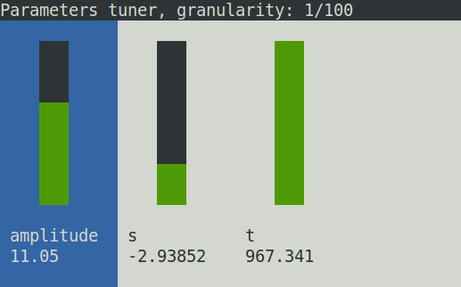
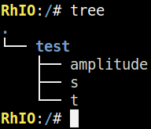

# Shell

## Running the shell

As [explained before](getting_started.md), the shell can be built using the cmake
of the ``Shell/`` directory. After building the shell binary, you can also ``make install``
to have it in your binary directory and run it from anywhere. The usage is:

    rhio [server [one shot command]]

The first argument of the program is the ip/hostname of the RhIO server to connect
to. If you give it no argument, it will connect to localhost.

If you specify more than one argument, all the rest will be considered as a command,
that will be runned once connected, and then the shell will quit (the one shot 
command). Thus, if you type:

    rhio 127.0.0.1 ls

This will run the ``ls`` command and quit.

## Features

The shell features a pretty much complete line edit, supporting cursor, colors,
auto-completion, CTRL+A, CTRL+E, CTRL+L etc.

It also stores the last typed commands into your ``$HOME/.rhio_history`` file, just like
bash.

## Commands

### ``help``

The first thing you may want to know about is the ``help`` command, which will list you
all the possible commands to type.

The green commands are the remote ones defined by the user in its code. All the others
are natives commands that will be available in any situation.

### ``ls`` (alias ``ll``)

Just like the well-known ``ls`` command, it will list the nodes that are currently
available and their descriptions.

Note that you can give ``ls`` an argument (and, for instance type ``ls /``) to list 
another node path.

### ``cd``

The ``cd`` command will change your current working directory. This directory will be 
indicated in the command prompt:

The ̀``test/`` prefix indicate that we are in the test directory

### Reading & setting parameter

If you type the name of a parameter, it will be readed, you can also directly set a new
value to this parameter using ``=``:

One can also define values with an absolute name, or a relative one:

### ``watch``

The ``watch`` command works just like ``ls``, but it will repeat the listing, refreshing
the output constantly.

This can be used to monitor values. If you provide no argument, the current directory will 
be watched. Else, all the given arguments (nodes or parameters) will be monitored.

### ``clear`` (CTRL+L)

The ``clear`` command will clear the screen. CTRL+L is a shortcut for that.

### ``log``

If you want to save the evolution of one or multiple parameters through time, you can use
the ``log`` command.

This will output CSV formatted values, which the first column will be the timestamp of
the value modification and the others columns are monitored parameters.

You can also provide an output file to this command, using the unix-like ``>`` notation:

The file will be written on the machine that runs RhIO.

### ``sync``

When working with RhIO, you will likely change your program, compile it and run it again.
This is not a problem with RhIO, because the client will reconnect automatically to the
server in most cases.

However, the nodes may have been changed. For performances reasons, the shell keep a
local cache representation of the known remote architecture. The ``sync`` command will
clear this cache and force the RhIO shell to re-synchronize itself with the remote server.

### Persistence: ``load``, ``save`` and ``diff``

The ``load`` command will trigger the load of the current node by the server. Symetrically,
the ``save`` command will make it persist the values.

You can check for changes with ``diff`` command. Here is an example:

A first ``diff`` states that everything is clean (thus, the values used currently are the
same as in the persisted files).

Then, changing the amplitude from ``1`` to ``2`` will make diff state that there is non
persisted unclean values.

Running ``load`` will make the ``1`` value back from the configuration file.

However, setting amplitude to ``2`` and running save will write in to the configuration file,
this is why the last diff is clean.

### ``plot`` and ``plot2d``

**Note: you need to have the gnuplot program to get this working.**

The ``plot`` command will monitor one or multiple values and plot the real-time change of
them.

The values are plotted with a time window restricted to a few seconds. When the plot is running,
you can still type in the rhio shell:

* ``q`` to quit the plot
* ``h`` to change the time window history used in the plot
* ``p`` to "pause/unpause the plot", this will allow you to browse the data without loosing them 
  because of the time window duration

You can also use ``plot2d`` to plot one or multiple variables in function of another (the first
argument will be the x-axis one).

If you only plot one parameter, the timestamp will be used as a palette to color the line.

### ``tune``

**Note: you need the ncurse library for this feature.**

The ``tune`` command allow you to both adjust and monitor several parameters at the same time.

You can move the selection using left and right arrow, and change the values using up/down keys. 
For booleans, a checkbox will replace the gauges.
The boundaries of the sliders are the metadatas used in the parameters definitions.

You can use all keys from ``0`` to ``9`` to give a parameter a direct value, or press the ``v``
key and then type your value, then enter to type the value manually.

The granularity of the moves (with up and down arrows) is 1/100 by default, but can be changed
by pressing the ``g`` key.

### ``tree``

This will list all the available nodes recursively.

Be careful, if you have a lot of nodes, this could take a lot of time to display! 

### ``repeat`` (alias ``rep``)

The ``repeat`` command will execute the given command continuously (until you press a key)
and display its output on your screen.

If you type ``repeat ls`` (or ``rep ls``), the result will be quite similar to `̀`watch``.

### ``delay`` (alias ``del``)

Delay will wait a given time and then execute a given action. ``delay 2 ls`` (or ``del 2 ls``)
will wait 2 second and then run the ls command.

