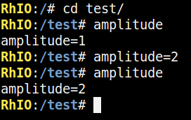

# Shell

## Running the shell

As [explained before](getting_started.md), the shell can be built using the cmake
of the ``Shell/`` directory. After building the shell binary, you can also ``make install``
to have it in your binary directory and run it from anywhere. The usage is:

    rhio [server [one shot command]]

The first argument of the program is the ip/hostname of the RhIO server to connect
to. If you give it no argument, it will connect to localhost.

If you specify more than one argument, all the rest will be considered as a command,
that will be runned once connected, and then the shell will quit (the one shot 
command). Thus, if you type:

    rhio 127.0.0.1 ls

This will run the ``ls`` command and quit.

## Features

The shell features a pretty much complete line edit, supporting cursor, colors,
auto-completion, CTRL+A, CTRL+E, CTRL+L etc.

It also stores the last typed commands into your ``$HOME/.rhio_history`` file, just like
bash.

## Commands

### ``help``

The first thing you may want to know about is the ``help`` command, which will list you
all the possible commands to type.

The green commands are the remote ones defined by the user in its code. All the others
are natives commands that will be available in any situation.

### ``ls``

Just like the well-known ``ls`` command, it will list the nodes that are currently
available and their descriptions.

Note that you can give ``ls`` an argument (and, for instance type ``ls /``) to list 
another node path.

### ``cd``

The ``cd`` command will change your current working directory. This directory will be 
indicated in the command prompt:

The ̀``test/`` prefix indicate that we are in the test directory

### Reading & setting parameter

If you type the name of a parameter, it will be readed, you can also directly set a new
value to this parameter using ``=``:

One can also define values with an absolute name, or a relative one:

### ``watch``

The ``watch`` command works just like ``ls``, but it will repeat the listing, refreshing
the output constantly.

This can be used to monitor values. If you provide no argument, the current directory will 
be watched. Else, all the given arguments (nodes or parameters) will be monitored.

### ``clear`` (CTRL+L)

The ``clear`` command will clear the screen. CTRL+L is a shortcut for that.

### ``log``

If you want to save the evolution of one or multiple parameters through time, you can use
the ``log`` command.

This will output CSV formatted values, which the first column will be the timestamp of
the value modification and the others columns are monitored parameters.

You can also provide an output file to this command, using the unix-like ``>`` notation:

!(log)[log.png]

The file will be written on the machine that runs RhIO.

### ``sync``

When working with RhIO, you will likely change your program, compile it and run it again.
This is not a problem with RhIO, because the client will reconnect automatically to the
server in most cases.

However, the nodes may have been changed. For performances reasons, the shell keep a
local cache representation of the known remote architecture. The ``sync`` command will
clear this cache and force the RhIO shell to re-synchronize itself with the remote server.

### Persistence: ``load``, ``save`` and ``diff``

The ``load`` command will trigger the load of the current node by the server. Symetrically,
the ``save`` command will make it persist the values.

You can check for changes with ``diff`` command. Here is an example:

A first ``diff`` states that everything is clean (thus, the values used currently are the
same as in the persisted files).

Then, changing the amplitude from ``1`` to ``2`` will make diff state that there is non
persisted unclean values.

Running ``load`` will make the ``1`` value back from the configuration file.

However, setting amplitude to ``2`` and running save will write in to the configuration file,
this is why the last diff is clean.
